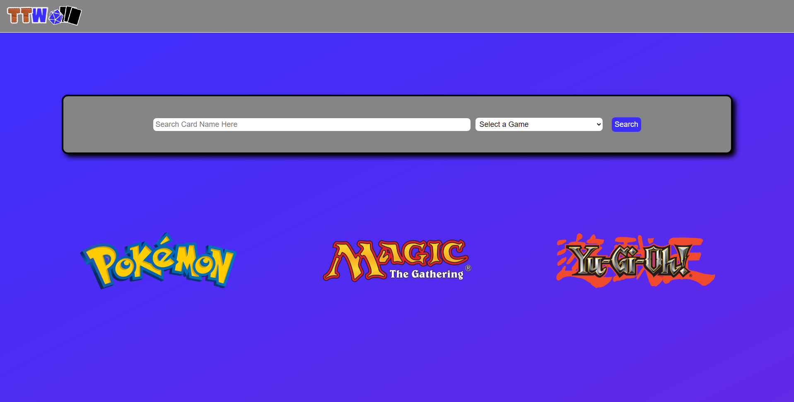
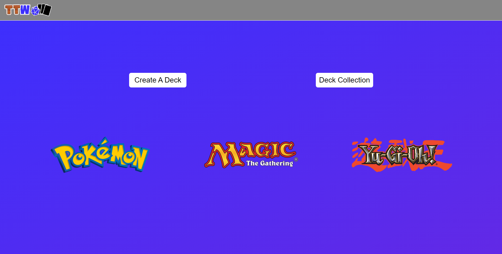
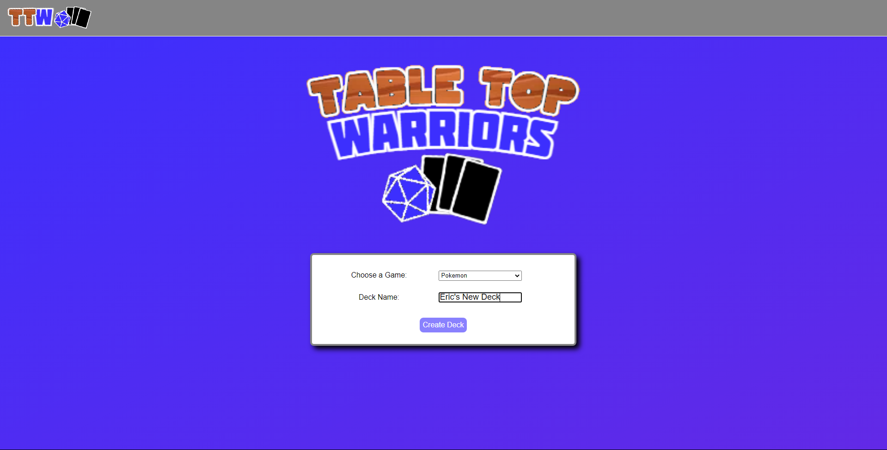

# Table Top Warriors

Deployed Application: 

GitHub Repository: https://github.com/Ericcrain77/table-top-warriors

## Table of Contents
* [Description](#description)
* [Screenshots](#Screenshots)
* [Questions](#questions)

## Description
Table Top Warriors is a website designed for trading card game enthusiasts to create, edit, and store their deck collection. Whether the user’s deck exists in real life, or virtually, Table Top Warriors is a useful tool in organizing the three most famous trading card games in the card game market.

## Screenshots
Landing Page

Log In/Sign Up Page

User Homepage

Deck Creation Page

Deck Edit Page

Deck Collection Page

## Questions
Reach out to me using my [Github account](https://github.com/Ericcrain77) or my [email](ericcrain77@gmail.com).