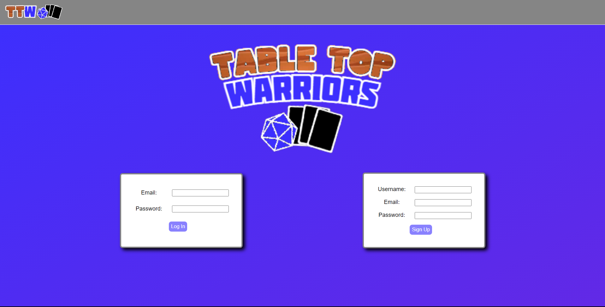

# Table Top Warriors

Deployed Application: https://glacial-wave-35066.herokuapp.com/

GitHub Repository: https://github.com/Ericcrain77/table-top-warriors

## Table of Contents
* [Description](#description)
* [Screenshots](#screenshots)
* [Technologies](#technologies)
* [Questions](#questions)

## Description
Table Top Warriors is a website designed for trading card game enthusiasts to create, edit, and store their deck collection. Whether the user’s deck exists in real life, or virtually, Table Top Warriors is a useful tool in organizing the three most famous trading card games in the card game market.

## Screenshots
Landing Page

Log In/Sign Up Page

User Homepage

Deck Creation Page

Deck Edit Page

Deck Collection Page

## Technologies
This application utilizes the following npm packages:
* bycrpt 
* connect-session-sequelize 
* dotenv 
* express 
* express-handlebars 
* express-session 
* mysql2 
* sequelize

It is written with html and javascript, stylized with css, and utilizes MySQL to save user email addresses and passwords as well as created decks with saved card information.

This application calls the Magic: The Gathering API, Pokemon TCG API, and Yu-Gi-Oh! API to fetch the card information to display on screen.

## Questions
Reach out to me using my [Github account](https://github.com/Ericcrain77) or my [email](ericcrain77@gmail.com).